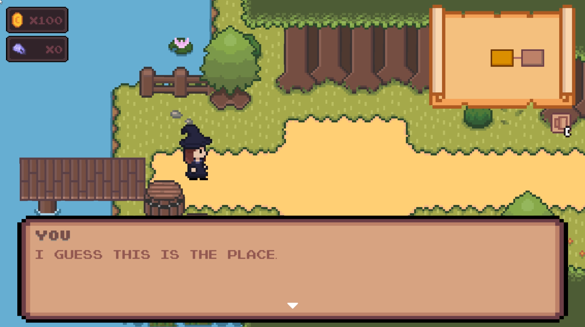
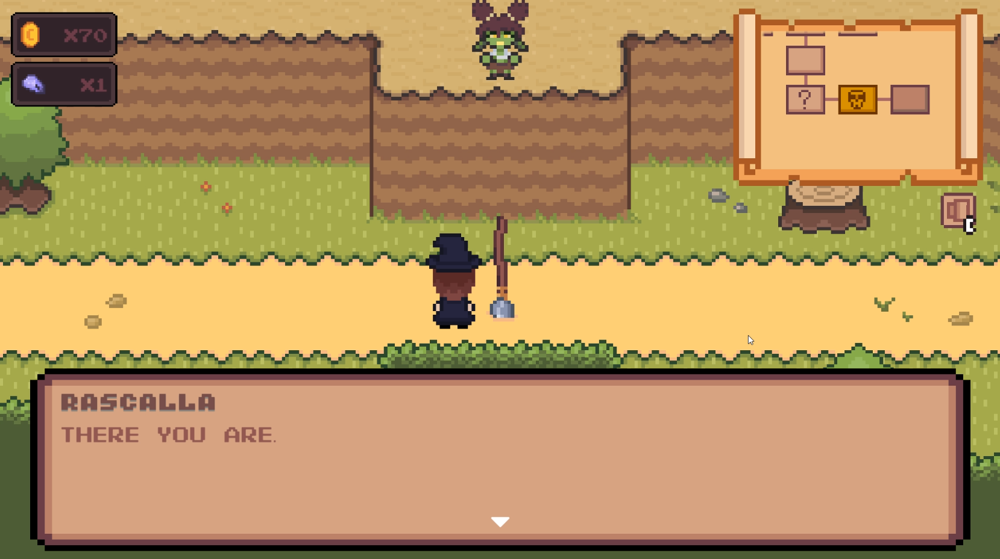
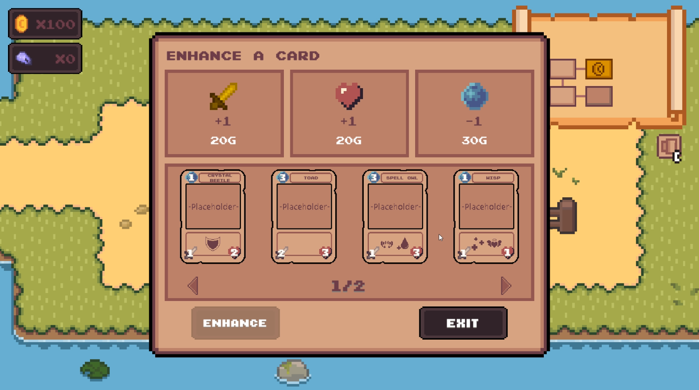

# Roguelike Card Game

2D roguelike karetní hra vytvořená v Unity a C#.

Hra kombinuje procedurálně generovanou mapu s tahovými karetními souboji. Projekt je stále ve vývoji a slouží také jako prostor pro experimentování s herními systémy, AI a různými způsoby jejich propojení.

## Hlavní funkce

- Procedurálně generovaná herní mapa
- Tahový karetní souboj
- AI protivník s různými strategiemi
- Systém karet a jejich schopností
- Více typů nepřátel a karet
- Uživatelské rozhraní
- Systém různých typů místností

## AI protivník

AI protivník dokáže vyhodnocovat aktuální stav souboje a podle něj vybírat své akce. Obsahuje několik herních strategií a různé úrovně obtížnosti.

## Procedurální generování

Herní mapa je vytvářena procedurálně z jednotlivých místností. Generátor zajišťuje jejich propojení a umístění různých typů místností v rámci herní mapy.

## Ukázka

### Overworld

### Combat

### Shops

## Video

[Podívat se na video ukázku](https://www.youtube.com/watch?v=uLOtuBAYSOc)

## Demo

[Stáhnout hratelnou ukázku](DEMO_URL)

## Stav projektu

Zdrojový kód není veřejně dostupný, repositář slouží pouze jako portfolio.
